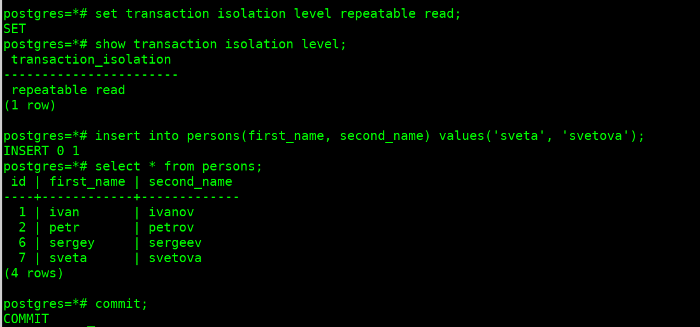
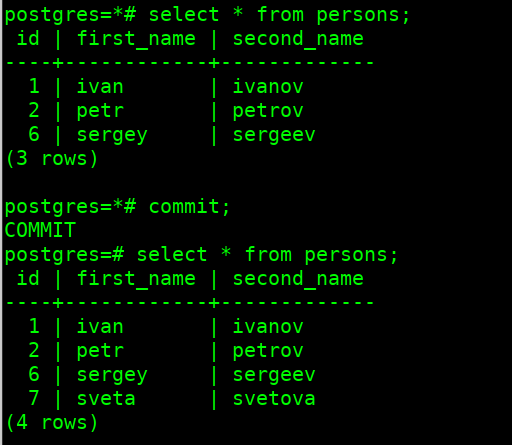

# Работа с уровнями изоляции транзакции в PostgreSQL

## Создание ВМ в ЯО

создан фолдер **postgres2024-19731029**

создана ВМ на минималках **2CPU / RAM 2GB / HDD 10GB / Ubuntu 24.04 LTS / прерываемая**

администратор **balitskiiov**, добавлен **публичный SSH-key**

## Подготовка ВМ

установлено обновление (`sudo apt update; sudo apt upgrade`)

установлен оконный менеджер (`sudo apt install screen`)

установлен postgresql последней версии (`sudo apt installl postgresql`)

## Выполнение задания

- запущена первая сессия **psql** (`sudo -i -u postgres psq`)
- открыто новое окно `Ctrl-a-c`, запущена вторая сессия **psql** (`sudo -i -u postgres psq`)
- переключения между окнами `Ctrl-a-n`

- выключить auto commit `\set AUTOCOMMIT off`
- проверить состояние `\echo :AUTOCOMMIT` => `off`
- сделать в первой сессии новую таблицу и наполнить ее данными

  ```
  create table persons(id serial, first_name text, second_name text);
  insert into persons(first_name, second_name) values('ivan', 'ivanov');
  insert into persons(first_name, second_name) values('petr', 'petrov');
  commit;
   ```

- посмотреть текущий уровень изоляции: `show transaction isolation level;` => `read committed`
- начать новую транзакцию в обоих сессиях с дефолтным (не меняя) уровнем изоляции
  - в первой сессии добавить новую запись
`insert into persons(first_name, second_name) values('sergey', 'sergeev');`
  - сделать select * from persons во второй сессии
  - видите ли вы новую запись и если да то почему?
    > не вижу, т.к. не выполнена фиксация транзакции (`commit;`)
  - завершить первую транзакцию - `commit;`
  - сделать `select * from persons;` во второй сессии
  - видите ли вы новую запись и если да то почему?
    > вижу, транзакция зафиксирована/завершена
- начать новые, но уже **repeatable read** транзакции - `set transaction isolation level repeatable read;`
  - в первой сессии добавить новую запись
`insert into persons(first_name, second_name) values('sveta', 'svetova');`
    - сделать `select * from persons;` во второй сессии
    - видите ли вы новую запись и если да то почему?
      > не вижу, т.к. не выполнена фиксация транзакции (`commit;`)
    - завершить первую транзакцию - `commit;`
    - сделать select * from persons во второй сессии
    - видите ли вы новую запись и если да то почему?
      > не вижу, т.к. не выполнена фиксация транзакции в текущей сессии (`commit;`)
    - завершить вторую транзакцию `commit;`
    - сделать `select * from persons;` во второй сессии
    - идите ли вы новую запись и если да то почему?
      > вижу, т.к. выполнена фиксация транзакции в текущей сессии (`commit;`)

|сессия 1|сессия 2|
|---|---|
|||

## Завершение работы

ВМ выключена
