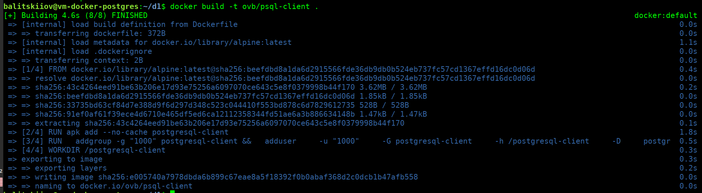
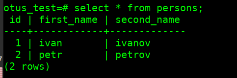
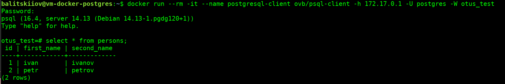

# Установка и настройка PostgteSQL в контейнере Docker
## Создание ВМ

Создаем ВМ 

> 2VCP / 2 GB / 10 GB HDD / прерываемая / Ubuntu 24.02

> Имя **vm-docker-postgres**

## Подготовка ВМ
- установлено обновление (`sudo apt update; sudo apt upgrade`)
- установлен оконный менеджер (`sudo apt install screen`)


## Установка docker
ставим докер по [инструкции](https://docs.docker.com/engine/install/ubuntu/#install-using-the-repository)

```
sudo apt-get update
sudo apt-get -y install ca-certificates curl
sudo install -m 0755 -d /etc/apt/keyrings
sudo curl -fsSL https://download.docker.com/linux/ubuntu/gpg -o /etc/apt/keyrings/docker.asc
sudo chmod a+r /etc/apt/keyrings/docker.asc

echo \
  "deb [arch=$(dpkg --print-architecture) signed-by=/etc/apt/keyrings/docker.asc] https://download.docker.com/linux/ubuntu \
  $(. /etc/os-release && echo "$VERSION_CODENAME") stable" | \
  sudo tee /etc/apt/sources.list.d/docker.list > /dev/null
sudo apt-get update

sudo apt-get -y install docker-ce docker-ce-cli containerd.io docker-buildx-plugin docker-compose-plugin

```

## Подготовка

- Добавляем текущего пользователя в группу docker

  `sudo usermod -aG docker balitskiiov`


- создаем каталог для БД

  `sudo mkdir -p /var/lib/postgres`

## Выполнение задания

### Запуск сервера

от пользователя **balitskiiov** запускаем **postgresql**, в соответствии с заданием, руководствуясь [описанием](https://hub.docker.com/_/postgres)

```
docker run -d \
	--name HW02 \
	-e POSTGRES_PASSWORD=123 \
	-p 5432:5432 \
	-e PGDATA=/var/lib/postgresql/data/pgdata \
	-v /var/lib/postgres:/var/lib/postgresql/data \
	postgres:14
```

### Создание образа клиента

<details open>

<summary>файл Dockerfile</summary>

```
FROM alpine:latest

RUN apk add --no-cache postgresql-client

ARG PUID=1000
ARG PGID=1000

RUN \
  addgroup -g "${PGID}" postgresql-client && \
  adduser \
    -u "${PUID}" \
    -G postgresql-client \
    -h /postgresql-client \
    -D \
    postgresql-client

WORKDIR /postgresql-client

USER postgresql-client

ENTRYPOINT ["psql"]
```
</details>

`docker build -t ovb/psql-client .`




### Проверка подключения и наполнение данными

- подключаемся извне - **успешно**

  `psql -h 84.201.169.31 -U postgres -W`

- по адресу хоста докер - **успешно**

  `docker run --rm -it --name postgresql-client ovb/psql-client -h 172.17.0.1 -U postgres -W`

- создаем БД **otus_test** и таблицу с данными

  `create database otus_test;`

  `\c otus_test`

```
  create table persons(id serial, first_name text, second_name text);
  insert into persons(first_name, second_name) values('ivan', 'ivanov');
  insert into persons(first_name, second_name) values('petr', 'petrov');
  select * from persons;
```



- по внутреннему адресу хоста - **успешно**

  `docker run --rm -it --name postgresql-client ovb/psql-client -h 10.131.0.34 -U postgres -W otus_test`

- по внешнему адресу хоста - **успешно**

  `docker run --rm -it --name postgresql-client ovb/psql-client -h 84.201.169.31 -U postgres -W otus_test`

### Проверка сохранности данных

- удаляем контейнер сервера PostgreSQL

  `docker remove -f HW02`

- запускаем повторно

```
docker run -d \
	--name HW02 \
	-e POSTGRES_PASSWORD=123 \
	-p 5432:5432 \
	-e PGDATA=/var/lib/postgresql/data/pgdata \
	-v /var/lib/postgres:/var/lib/postgresql/data \
	postgres:14
```

- присоединяемся

  `docker run --rm -it --name postgresql-client ovb/psql-client -h 10.131.0.34 -U postgres -W otus_test`

- выбираем данные - **данные на месте**

  `select * from persons;`




## Работа выполнена
Вопросов не возникло.
