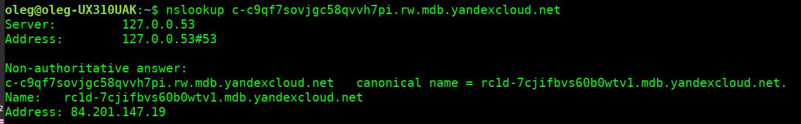

# Использование Managed Service for PostgreSQL

## Создаем кластер PostgreSQL с использованием Managed Service for PostgreSQL в Yandex.Cloud
- Создаем кластер в WEB-консоль


## Ограничим доступ (входящий трафик) через Security Group


## проверим статус кластера в консоли yc

 

- хосты в кластере

 

- проверка разрешения FQDN кластера в IP

 

 


## Подключение к БД

- скачиваем сертификат

```
mkdir -p ~/.postgresql && \
wget "https://storage.yandexcloud.net/cloud-certs/CA.pem" \
    --output-document ~/.postgresql/root.crt && \
chmod 0600 ~/.postgresql/root.crt
```

- подключаемся

```
psql "host=rc1d-7cjifbvs60b0wtv1.mdb.yandexcloud.net \
    port=6432 \
    sslmode=verify-full \
    dbname=db1 \
    user=user1 \
    target_session_attrs=read-write"
```

 

- подключаемся по имени FQDN кластера к мастеру

```
psql "host=c-c9qf7sovjgc58qvvh7pi.rw.mdb.yandexcloud.net \
    port=6432 \
    sslmode=verify-full \
    dbname=db1 \
    user=user1 \
    target_session_attrs=read-write"
```

 


## Расширение кластера

- добавляем хост в кластер (без публичного доступа), ждем завершения 9 минут


- даем публичный доступ ко второму хосту, проверяем FQDN мастера и наименее отстающей реплики


- топология


## Смена ролей в кластере

- переключаем мастера


- проверяем FQDN мастера и наименее отстающей реплики


## Проверяем кластер на доступ

- подключаемся по имени FQDN кластера к мастеру

```
psql "host=c-c9qf7sovjgc58qvvh7pi.rw.mdb.yandexcloud.net \
    port=6432 \
    sslmode=verify-full \
    dbname=db1 \
    user=user1 \
    target_session_attrs=read-write"
```


- подключаемся по имени FQDN кластера к реплике - можно только в режиме **read-only**

```
psql "host=c-c9qf7sovjgc58qvvh7pi.ro.mdb.yandexcloud.net \
    port=6432 \
    sslmode=verify-full \
    dbname=db1 \
    user=user1 \
    target_session_attrs=read-only"
```


## Удаляем кластер

работа завершена
