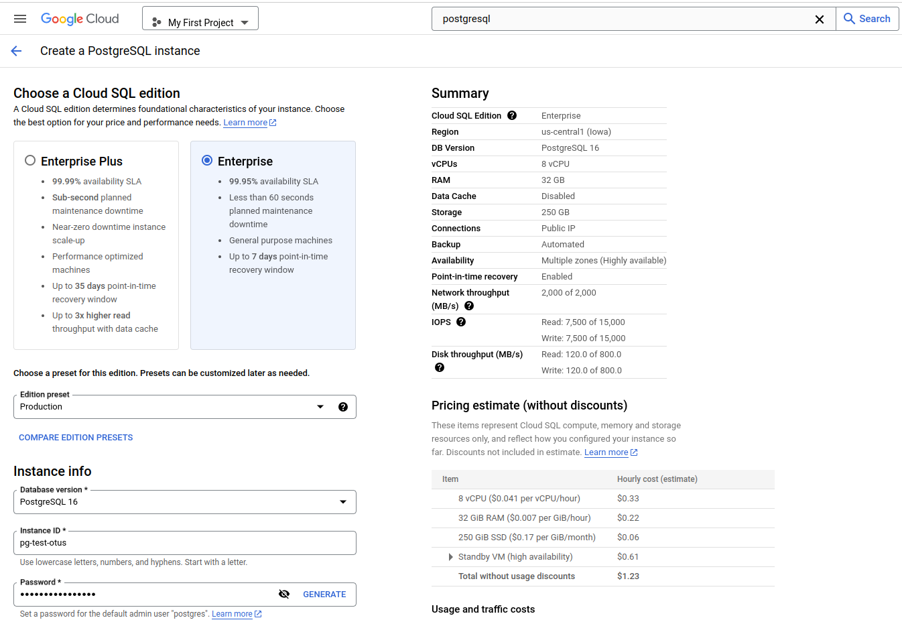
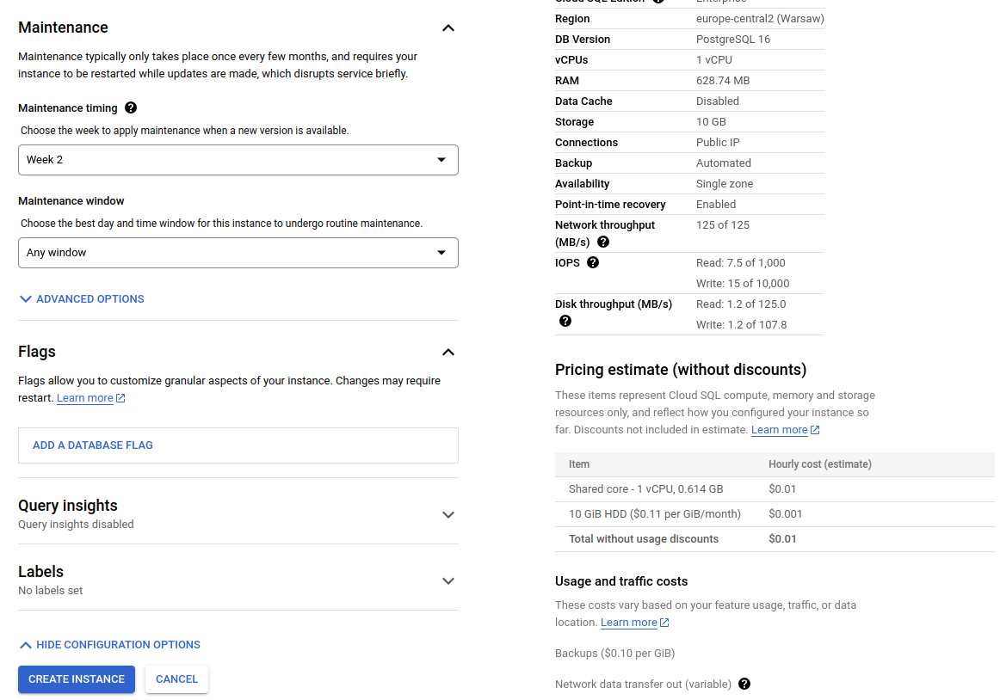

# Создание кластера в VKCloud

## Создание кластера

## Подключение к кластеру

## Отказоустойчивость

# Создание и работа с кластером PostgreSQL в Google Cloud platform

## Создание кластера

мастер проводит по шагам, ничего сложного нет.

Особенность:
- получаем суперпользователя postgres, и полный доступ к СУБД.
- тонкая настройка - от одного vCPU

 

 

 

 

 

 

 

 

## Подключение к кластеру

## Отказоустойчивость

