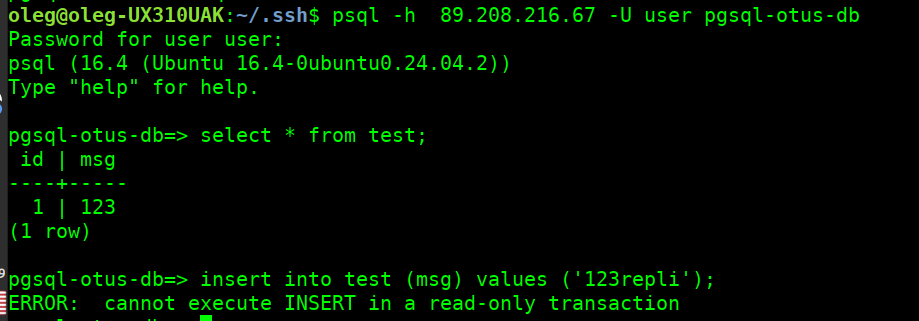
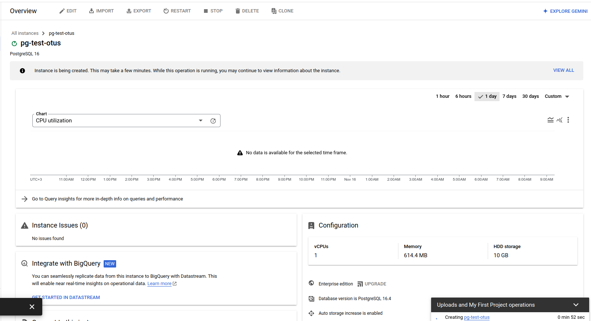
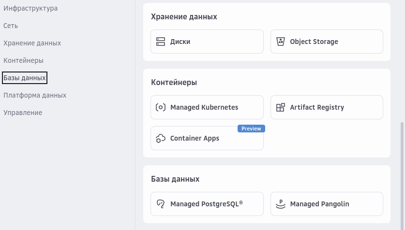

# Создание кластера в VKCloud

## Создание кластера

 

 

С первого раза не получилось, решался вопрос через тех.поддержку

 

### Ответ техподдержки

> на текущий момент есть визуальная ошибка при создании каждой БД, в итоге создание завершается успешно. Разработчики в курсе этой проблемы, решение будет в ближайшее время.

после общения с тех.поддержкой и повторного создания - получилось создать и присоедениться

Подключение к БД по publci IP возможно сразу, требуется править правила firewall

Установлено ограничение только с домашнего IP

По умолчанию - **accept all**, чтобы закрыть доступ **ВСЕМ** нужно придумать какое-то "левое" правило, удаление всех правил на входящий трафик приводит к полному доступу на **все порты для всех**

## Реплика и масштабирование

### в отличие от ЯО, для доступа к read-only реплике ее нужно создать, поддерживается множество реплик в разных зонах (3 зоны)

 

### Реплика создана, доступ только на чтение

выполнение операций на мастере

 

выполнение операций на реплике

 

### Горизонтальное масштабирование с Single в Cluster не поддерживается (не найдено в документации и в консоли)

##  Создание кластера из 3х нод

 

 

 

И снова визуализируется ошибка, просто ждем

 

и после ожидания

 

подключаемся

 

меняем мастера

 

ждем

 

и проверяем

 

# Создание и работа с кластером PostgreSQL в Google Cloud platform

## Создание инстанса

мастер проводит по шагам, ничего сложного нет.

Особенность:
- получаем суперпользователя postgres, и полный доступ к СУБД.
- тонкая настройка ресурсов - от одного vCPU

 

 

 

 

 

### Создание 

 

 

### Инстансе создавался долго (субъективно), выполнен backup

 

## Подключение к инстансу

параметры подключения понятны

 

по умолчанию кластер не доступен - порт 5432 закрыт

 

нужно добавить авторизованные сети в свойствах инстанса (**Connections** -> **Networking** -> **Authorized networks**)

 

Порт открыт

 

Доступ к БД есть

 

Создаем БД через **psql**

 

Или можно создать через WEB-консоль

 

## Отказоустойчивость и доступность

Изначально инстанс создавался как **Not highly available**

Добавление простое - добавляем зону, и ждем создание хоста инстанса в другой зоне минут 10 (зависит от размера БД)

 

## Реплика

### в отличие от ЯО, для доступа к read-only реплике ее нужно создать, поддерживается множество реплик в разных регионах и зонах

 

- создаем реплику, задаем параметры

 

- получаем реплику

 

- параметры подключения к реплике

 

- подключение к реплике

 

# Создание кластера в SberCloud

## Создание кластера

отказоустойчивый кластер не поддерживается, создание с "мастером" простое.

 

 

 

тюнинг "тонкий"

 

 

 

И ошибка, надо идти в поддержку вероятно

 

Со второй попытки - ошибка

 

Чат оперативно не решил

 

## Сыроватое решение, как кажется... (работал в Evolution, а оно обрезанное)

## Обновление

Получил ответ из тех.поддержки
> Пожалуйста, создайте ВМ в AZ1 и пересоздайте кластер. Вы сможете сразу удалить ВМ, это необходимо лишь для инициализации стандартных ресурсов.

## Повторение

 
