# Манипуляции с дисками в Yandex.Cloud и файлами данных PostgreSQL средствами ОС

## создаем ВМ в ЯО

### Получим список "свежих" публичных имиджей для создания ВМ (Ubuntu 22.04 LTS)
```bash 
yc compute image list --folder-id standard-images |grep "ubuntu-2204-lts "|sort -k3 -t '|' -r|head -3
```


```
+----------------------+------------------------------------------------------------+-------------------------------------------------+--------------------------------+--------+
|          ID          |                            NAME                            |                     FAMILY                      |          PRODUCT IDS           | STATUS |
+----------------------+------------------------------------------------------------+-------------------------------------------------+--------------------------------+--------+
| fd81no7ub0p1nooono37 | ubuntu-22-04-lts-v20241111                                 | ubuntu-2204-lts                                 | f2ene4guh7e0d4mgtfis           | READY  |
| fd80ok8sil1fn2gqbm6h | ubuntu-22-04-lts-v20241014                                 | ubuntu-2204-lts                                 | f2essuur1lbjq176dukv           | READY  |
| fd842fimj1jg6vmfee6r | ubuntu-22-04-lts-v20241007                                 | ubuntu-2204-lts                                 | f2eig1b26vb4fmrdgjav           | READY  |

```

### Создание ВМ в командной строке

- скрипт
``` bash
yc compute instance create \
    otus-pg-01 \
    --zone=ru-central1-d \
    --description "test VM for PostgreSQL" \
    --public-ip \
    --create-boot-disk name=otus-pg-01-boot,size=10,image-id=fd81no7ub0p1nooono37 \
    --create-disk name=otus-pg-01-data,size=10 \
    --memory 2GB \
    --cores 2 \
    --metadata-from-file user-data=metadata.yaml 
```

- содержание **metadata.yaml**

```yaml
#cloud-config
datasource:
  Ec2:
    strict_id: false
ssh_pwauth: no
users:
- name: balitskiiov
  sudo: 'ALL=(ALL) NOPASSWD:ALL'
  shell: /bin/bash
  ssh_authorized_keys:
  - ssh-rsa AAAAB3NzaC1yc2EAAAABJQAAAgEAziMfjsq7fqgL9Bt6A8xG18ZY4ZyGbqr12FKXlMIOM2l5Lrnd5iqV+lhURMMAee1nc1vXzVrrO4hWaMsxvGEbW6QlvGrJ+Fhq511knLsnxdMjBi0rqyVjOfd
2x9GCovWnLeG/ay9ZmWlIboBg/6Zx4V3oEmq7y7meP4ESaKAHRVL3xwKH6BhPTjLsDLz+oK69Dsb3H/BdwUbSAtOvcqszaACCXjwHmU6KNXBAlq8DWN2Lml3Ckqtw+uRdDQEg+5NbfAKEyshxjKhY6uwW0N3EuNa8+u/Ku0zOx4moIvR5NElcOq5VWV03D4KiSKOqOjc6H6FYCE6s6BlZrXL00hskoygSBvAmwMfz1Cq5zaNB2pOPx8FJIhVe/Qtx+zC19+kUuyIp0Hxyt2ZAtVXoIqSTuu7U9liEGhLgMb3SRgn7KggSD
DauBLhkJq3iJujNLaWUfMHMdS7DHTl8AwIOabqq3DZpnRZ4HfS1VH94ucvd+zWRM/iNoeiQmUrdKjVrTlCJruPJ1AZMISNTrlSlLWTPWXxRvQ98GIXEc5qnexqnodpCPtFq/FY0zv0NqIhpLn7wb1JUJJt57u/1P+g16915uUD7Dq9G8NrsJjEzW3xU8Upea2/9+LH4EOpoGdFVMXDSVEO04WFB+lbSoiA00n/7UUAlLyfwNwugtxv4KY6YxBk= BalitskiiOV-230430
```

- Лог создания ВМ
```
done (38s)
id: fv416n5fqbgjr5q92kps
folder_id: b1g7816h7k9l476tjngc
created_at: "2024-11-22T19:45:15Z"
name: otus-pg-01
description: test VM for PostgreSQL
zone_id: ru-central1-d
platform_id: standard-v2
resources:
  memory: "2147483648"
  cores: "2"
  core_fraction: "100"
status: RUNNING
metadata_options:
  gce_http_endpoint: ENABLED
  aws_v1_http_endpoint: ENABLED
  gce_http_token: ENABLED
  aws_v1_http_token: DISABLED
boot_disk:
  mode: READ_WRITE
  device_name: fv4v1av1uh6q5882ubdu
  auto_delete: true
  disk_id: fv4v1av1uh6q5882ubdu
secondary_disks:
  - mode: READ_WRITE
    device_name: fv4hjj2uhnpfgjmd8598
    disk_id: fv4hjj2uhnpfgjmd8598
network_interfaces:
  - index: "0"
    mac_address: d0:0d:13:5c:af:d2
    subnet_id: fl83na15dlr3m50buajm
    primary_v4_address:
      address: 10.131.0.13
      one_to_one_nat:
        address: 84.201.180.137
        ip_version: IPV4
serial_port_settings:
  ssh_authorization: OS_LOGIN
gpu_settings: {}
fqdn: fv416n5fqbgjr5q92kps.auto.internal
scheduling_policy: {}
network_settings:
  type: STANDARD
placement_policy: {}
hardware_generation:
  legacy_features:
    pci_topology: PCI_TOPOLOGY_V1

```
- результат в WEB-консоли

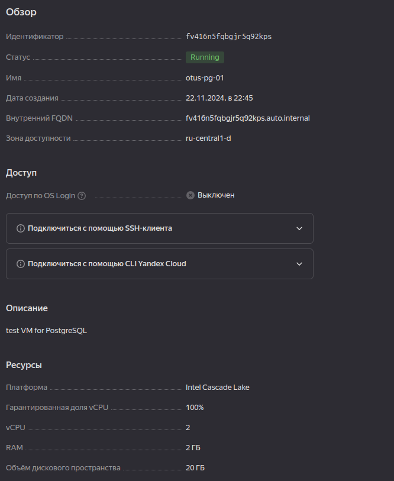

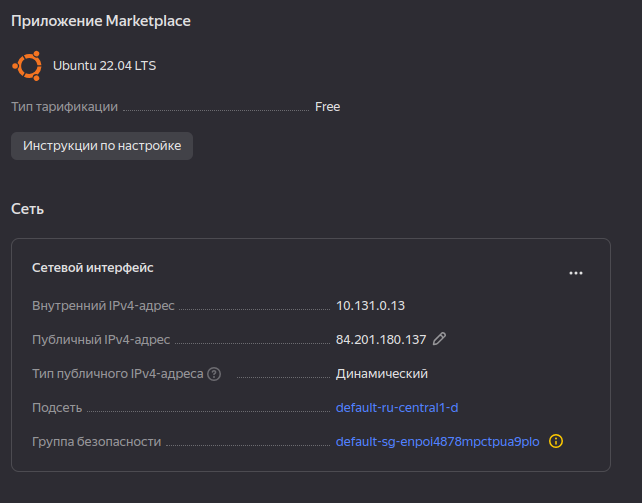

- корректировка текущей **Secutity Group**

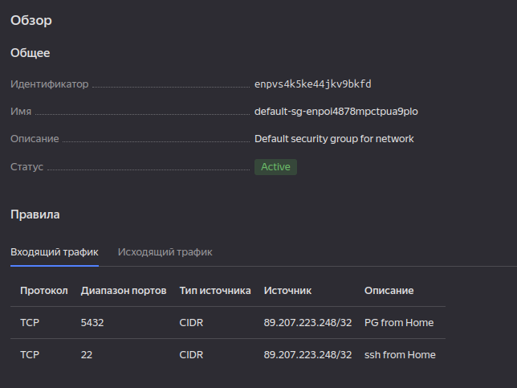

- Зашли на сервер

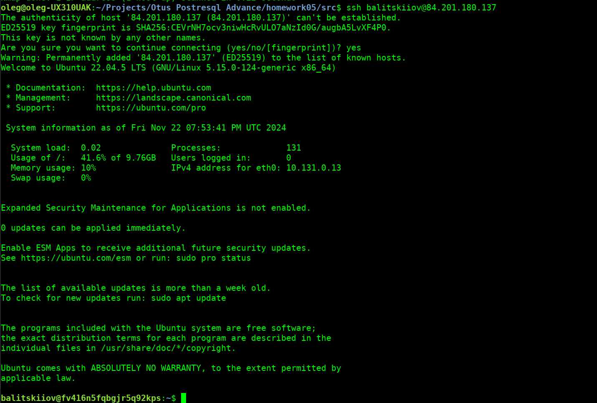

### Обновили, установили PostgreSQL v15

`apt update; apt upgrade -y`

`apt install -y postgresql`

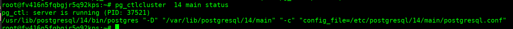

- сменил интерфейс для удаленного доступа
  корректировка параметра `listen_addresses='*'` в файле `/etc/postgresql/14/main/postgresql.conf`
- рестарт PostgreSQL `/etc/postgresql/14/main/postgresql.conf`)

- Проверил интерфейс и порт `netstat -nltp`

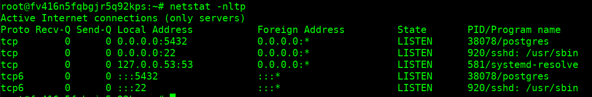


## Выполнение задания
- подключился к PostgreSQL, создал таблицу

`sudo -i -u postgres psql`

```sql
create table test(c1 text);
insert into test values('1');
select * from test;
```

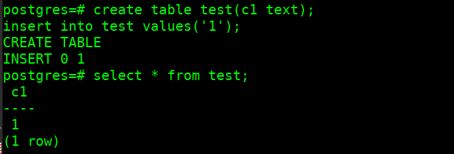

- остановил PostgreSQL `pg_ctlcluster 15 main stop`

- использую диск (/dev/vdb), созданный при создании ВМ

`lsblk`

```
NAME   MAJ:MIN RM   SIZE RO TYPE MOUNTPOINTS
...
vda    252:0    0    10G  0 disk 
├─vda1 252:1    0     1M  0 part 
└─vda2 252:2    0    10G  0 part /
vdb    252:16   0    10G  0 disk 

```

- Создаю раздел и ФС

```
parted /dev/vdb mklabel gpt
parted -a optimal -s /dev/vdb mkpart primary ext4  0% 100%
mkfs.ext4 /dev/vdb1
```

Результат
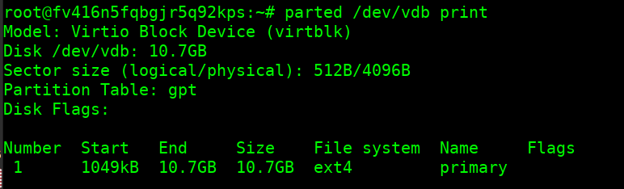

- Получаем UUID раздела, создаем каталог монтирования и добавляем запись в `/etc/fstab` 

`mkdir -p /mnt/data`

`blkid /dev/vdb1`


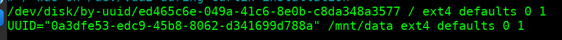

- Монтируем, меняем права

```
mount /mnt/data
chown postgres: /mnt/data
```

- Копируем каталог с данными из `/var/lib/postgresql/14` в `/mnt/data`

`rsyn -arv /var/lib/postgresql/14 /mnt/data`

- Меняем параметр `data_directory = '/var/lib/postgresql/14/main'` в файле `/etc/postgresql/14/main/postgres.conf` на новое значение `data_directory = '/mnt/data/14/main'`

- Запускаем и проверяем статус - успешно
```bash
pg_ctlcluster 14 main start
pg_ctlcluster 14 main status
```
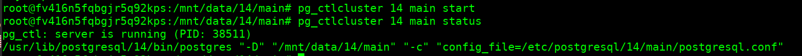

- Данные на месте

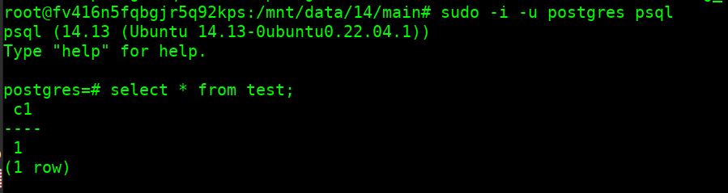


## Выполнение задания со "звездочкой"

### Создаем новую ВМ
- скрипт
``` bash
yc compute instance create \
    otus-pg-02 \
    --zone=ru-central1-d \
    --description "test VM for PostgreSQL - 02" \
    --public-ip \
    --create-boot-disk name=otus-pg-02-boot,size=10,image-id=fd81no7ub0p1nooono37 \
    --memory 2GB \
    --cores 2 \
    --metadata-from-file user-data=metadata.yaml 
```

### Получаем список ВМ и дисков

`yc compute instance list`

```
+----------------------+------------+---------------+---------+----------------+-------------+
|          ID          |    NAME    |    ZONE ID    | STATUS  |  EXTERNAL IP   | INTERNAL IP |
+----------------------+------------+---------------+---------+----------------+-------------+
| fv416n5fqbgjr5q92kps | otus-pg-01 | ru-central1-d | RUNNING | 84.201.180.137 | 10.131.0.13 |
| fv45l43jm1kouag6t17c | otus-pg-02 | ru-central1-d | RUNNING | 84.201.168.110 | 10.131.0.18 |
+----------------------+------------+---------------+---------+----------------+-------------+

```

и список дисков `yc compute disk list`

```
+----------------------+-----------------+-------------+---------------+--------+----------------------+-----------------+-------------+
|          ID          |      NAME       |    SIZE     |     ZONE      | STATUS |     INSTANCE IDS     | PLACEMENT GROUP | DESCRIPTION |
+----------------------+-----------------+-------------+---------------+--------+----------------------+-----------------+-------------+
| fv40glqjbkls8a8hrj5k | otus-pg-02-boot | 10737418240 | ru-central1-d | READY  | fv45l43jm1kouag6t17c |                 |             |
| fv4hjj2uhnpfgjmd8598 | otus-pg-01-data | 10737418240 | ru-central1-d | READY  | fv416n5fqbgjr5q92kps |                 |             |
| fv4v1av1uh6q5882ubdu | otus-pg-01-boot | 10737418240 | ru-central1-d | READY  | fv416n5fqbgjr5q92kps |                 |             |
+----------------------+-----------------+-------------+---------------+--------+----------------------+-----------------+-------------+
```

- останавливаем otus-pg-01
`yc compute instance  stop fv416n5fqbgjr5q92kps`

```
+----------------------+------------+---------------+---------+----------------+-------------+
|          ID          |    NAME    |    ZONE ID    | STATUS  |  EXTERNAL IP   | INTERNAL IP |
+----------------------+------------+---------------+---------+----------------+-------------+
| fv416n5fqbgjr5q92kps | otus-pg-01 | ru-central1-d | STOPPED |                | 10.131.0.13 |
| fv45l43jm1kouag6t17c | otus-pg-02 | ru-central1-d | RUNNING | 84.201.168.110 | 10.131.0.18 |
+----------------------+------------+---------------+---------+----------------+-------------+

```

### Перенос дисков

- отключаем диск от `otus-pg-01` и присоединяем к `otus-pg-02`

`yc compute instance detach-disk --id fv416n5fqbgjr5q92kps --disk-id fv4hjj2uhnpfgjmd8598`

`yc compute instance attach-disk --id fv45l43jm1kouag6t17c --disk-id fv4hjj2uhnpfgjmd8598`

### Миграция данных и проверка результатов переноса

- Входим на ВМ

`ssh balitskiiov@84.201.168.110`

- обновляем. ставим PostgreSQL

`apt update; apt upgrade -y; apt install -y postgesql`

- Монтируем диск с существующими данными в `/mnt`

`mount /dev/vdb1 /mnt`

- Останавливаем PostgreSQL, удаляем каталог с данными, копируем  данные с диска, запускаем

```bash
pg_ctlcluster 14 main stop
mv -v /var/lib/postgresql/14/main /tmp
rsync -arv /mnt/14/main /var/lib/postgresql/14
#проверяем что скопировано и права сохранились
ls -ld /var/lib/postgresql/14/main/*
pg_ctlcluster 14 main start
```

- проверяем - данные приехали

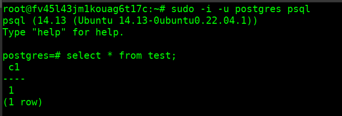

- почему не меняем параметры размещения на /mnt, и прочее: не нжно портить данные на "транспортном диске"

## Зачистка

- удаляем ВМ

`yc compute instance  delete --id fv416n5fqbgjr5q92kps`

`yc compute instance  delete --id fv45l43jm1kouag6t17c`

- удаляем диски с данными

`yc compute disk list`

```
+----------------------+-----------------+-------------+---------------+--------+--------------+-----------------+-------------+
|          ID          |      NAME       |    SIZE     |     ZONE      | STATUS | INSTANCE IDS | PLACEMENT GROUP | DESCRIPTION |
+----------------------+-----------------+-------------+---------------+--------+--------------+-----------------+-------------+
| fv4hjj2uhnpfgjmd8598 | otus-pg-01-data | 10737418240 | ru-central1-d | READY  |              |                 |             |
+----------------------+-----------------+-------------+---------------+--------+--------------+-----------------+-------------+

```

`yc compute disk delete --id fv4hjj2uhnpfgjmd8598`