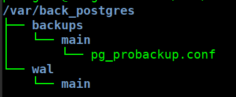
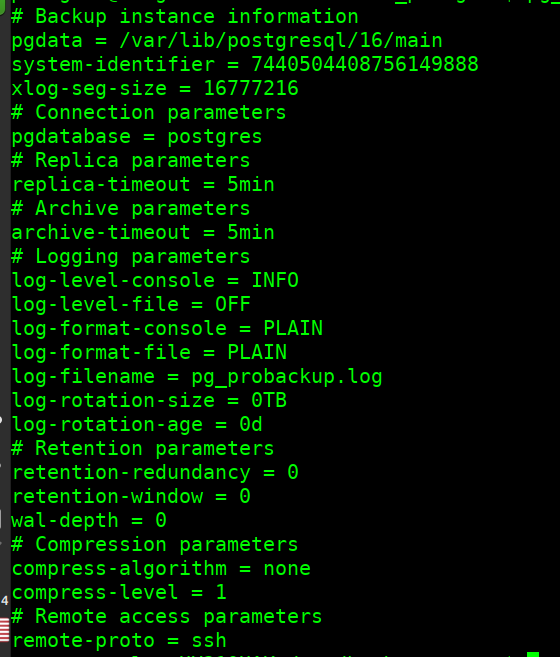
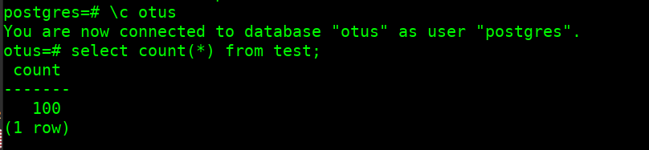
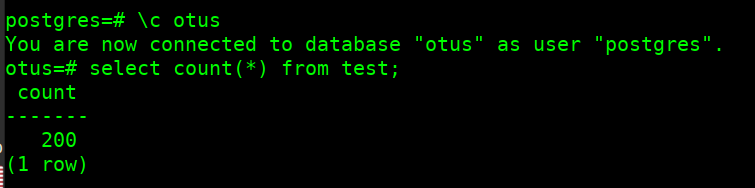

# Использование pg_probackup

## Установка pg_probackup на Ubuntu-like system (Linux Mint 22)

Установку производим по [инструкции](https://postgrespro.github.io/pg_probackup/#pbk-install-deb), корректируя на особенности дистрибутива

### Устанавливаем ключ репозитория

```bash
wget -qO - https://repo.postgrespro.ru/pg_probackup/keys/GPG-KEY-PG-PROBACKUP |\
sudo tee /etc/apt/keyrings/pg_probackup.asc
```

### Добавляем репозиторий
```bash
. /etc/os-release
echo "deb [arch=amd64] https://repo.postgrespro.ru/pg_probackup/deb $UBUNTU_CODENAME main-$UBUNTU_CODENAME" | \
sudo tee /etc/apt/sources.list.d/pg_probackup.list
```

### Список доступных пакетов

```bash
sudo apt update
apt search pg_probackup
```

### Доступные пакеты

```log
pg-probackup-12 - Backup tool for PostgreSQL.
pg-probackup-12-dbg - Backup tool for PostgreSQL.
pg-probackup-13 - Backup tool for PostgreSQL.
pg-probackup-13-dbg - Backup tool for PostgreSQL.
pg-probackup-14 - Backup tool for PostgreSQL.
pg-probackup-14-dbg - Backup tool for PostgreSQL.
pg-probackup-15 - Backup tool for PostgreSQL.
pg-probackup-15-dbg - Backup tool for PostgreSQL.
pg-probackup-16 - Backup tool for PostgreSQL.
pg-probackup-16-dbg - Backup tool for PostgreSQL.
```

### Устанавливаем требуемый пакет

- проверям версию PotgreSQL

```bash
pg_lsclusters
```

- работающий кластер

Ver|Cluster|Port|Status|Owner|Data directory|Log file
---|---    |--- |---   |---  |--------------|---
16|main|5432|online|postgres|/var/lib/postgresql/16/main|/var/log/postgresql/postgresql-16-main.log

- устанавливаем пакет под требуемую версию

```bash
sudo apt install pg-probackup-16
```

## Настройка pg_probackup

### Создаем каталог для хранения резервных копий

```bash
sudo sh -c 'back=/var/back_postgres; mkdir $back ; chmod 755 $back ; chown postgres: $back'
```

### Инициализируем созданный каталог для бакапов:
```bash
sudo -u postgres pg_probackup-16 init -B /var/back_postgres
```

**результат** 
`INFO: Backup catalog '/var/back_postgres' successfully initialized`

создано 2 каталога
```log
drwx------ 3 postgres postgres 4096 дек  4 17:57 /var/back_postgres/backups
drwx------ 3 postgres postgres 4096 дек  4 17:57 /var/back_postgres/wal
```

### добавляем инстанс __main__

```bash
sudo -u postgres pg_probackup-16 add-instance --instance 'main' -D /var/lib/postgresql/16/main -B /var/back_postgres
```

**результат** `INFO: Instance 'main' successfully initialized`

получена структура каталогов



содержимое файла **pg_probackup.conf**

```conf
# Backup instance information
pgdata = /var/lib/postgresql/16/main
system-identifier = 7440504408756149888
xlog-seg-size = 16777216
```

## Игры с копиями

> **далее выполняем команды от пользователя postgres**
> экспортируем переменную, для удобства работы

```bash
export BACKUP_PATH=/var/back_postgres
```

### проверяем статус 

```bash
pg_probackup-16 show-config --instance main
```



### "зальем" данные

```sql
CREATE DATABASE otus;
\c otus
CREATE TABLE test(i int);
insert into test(i) select * from generate_series(1, 100);
```

### выполняем копию кластера main

```bash
pg_probackup-16 backup --instance 'main' -b FULL --stream --temp-slot
pg_probackup-16 show
```

**результат**

```log
NFO: Backup start, pg_probackup version: 2.5.15, instance: main, backup ID: SNZ8PR, backup mode: FULL, wal mode: STREAM, remote: false, compress-algorithm: none, compress-level: 1
INFO: This PostgreSQL instance was initialized with data block checksums. Data block corruption will be detected
WARNING: Current PostgreSQL role is superuser. It is not recommended to run pg_probackup under superuser.
INFO: Database backup start
INFO: wait for pg_backup_start()
INFO: Wait for WAL segment /var/back_postgres/backups/main/SNZ8PR/database/pg_wal/000000010000000000000002 to be streamed
INFO: PGDATA size: 30MB
INFO: Current Start LSN: 0/2000028, TLI: 1
INFO: Start transferring data files
INFO: Data files are transferred, time elapsed: 0
INFO: wait for pg_stop_backup()
INFO: pg_stop backup() successfully executed
INFO: stop_lsn: 0/2000168
INFO: Getting the Recovery Time from WAL
INFO: Syncing backup files to disk
INFO: Backup files are synced, time elapsed: 0
INFO: Validating backup SNZ8PR
INFO: Backup SNZ8PR data files are valid
INFO: Backup SNZ8PR resident size: 46MB
INFO: Backup SNZ8PR completed


BACKUP INSTANCE 'main'
================================================================================================================================
 Instance  Version  ID      Recovery Time           Mode  WAL Mode  TLI  Time  Data   WAL  Zratio  Start LSN  Stop LSN   Status 
================================================================================================================================
 main      16       SNZ8PR  2024-12-04 19:05:52+03  FULL  STREAM    1/0   10s  30MB  16MB    1,00  0/2000028  0/2000168  OK     
```

**примечание**: нужно создавать кластер с `--data-checksums`, к примеру

```bash
pg_createcluster 16 main -- --data-checksums
```

### "дольем" данные

```sql
\c otus
insert into test(i) select * from generate_series(101, 200);
```

### создаем инкрементальную копию

```bash
pg_probackup-16 backup --instance 'main' -b DELTA --stream --temp-slot
pg_probackup-16 show
```

**Результат** 

```log
INFO: Backup start, pg_probackup version: 2.5.15, instance: main, backup ID: SNZ8WV, backup mode: DELTA, wal mode: STREAM, remote: false, compress-algorithm: none, compress-level: 1
INFO: This PostgreSQL instance was initialized with data block checksums. Data block corruption will be detected
WARNING: Current PostgreSQL role is superuser. It is not recommended to run pg_probackup under superuser.
INFO: Database backup start
INFO: wait for pg_backup_start()
INFO: Parent backup: SNZ8PR
INFO: Wait for WAL segment /var/back_postgres/backups/main/SNZ8WV/database/pg_wal/000000010000000000000004 to be streamed
INFO: PGDATA size: 30MB
INFO: Current Start LSN: 0/4000028, TLI: 1
INFO: Parent Start LSN: 0/2000028, TLI: 1
INFO: Start transferring data files
INFO: Data files are transferred, time elapsed: 0
INFO: wait for pg_stop_backup()
INFO: pg_stop backup() successfully executed
INFO: stop_lsn: 0/4000168
INFO: Getting the Recovery Time from WAL
INFO: Syncing backup files to disk
INFO: Backup files are synced, time elapsed: 1s
INFO: Validating backup SNZ8WV
INFO: Backup SNZ8WV data files are valid
INFO: Backup SNZ8WV resident size: 32MB
INFO: Backup SNZ8WV completed

BACKUP INSTANCE 'main'
==================================================================================================================================
 Instance  Version  ID      Recovery Time           Mode   WAL Mode  TLI  Time   Data   WAL  Zratio  Start LSN  Stop LSN   Status 
==================================================================================================================================
 main      16       SNZ8WV  2024-12-04 19:10:08+03  DELTA  STREAM    1/1   10s  127kB  32MB    1,00  0/4000028  0/4000168  OK     
 main      16       SNZ8PR  2024-12-04 19:05:52+03  FULL   STREAM    1/0   10s   30MB  16MB    1,00  0/2000028  0/2000168  OK     

```

### создаем новый кластер **test**

```bash
sudo -u postgres pg_createcluster 16 test -- --data-checksums
```

### проверка

```bash
pg_lsclusters
```

Ver|Cluster|Port|Status|Owner|Data directory|Log file
---|---|---|---|---|---|---
16| main|5432|online|postgres|/var/lib/postgresql/16/main|/var/log/postgresql/postgresql-16-main.log
16|test|5433|online|postgres|/var/lib/postgresql/16/test|/var/log/postgresql/postgresql-16-test.log

### удаляем каталог с данными в кластере **test**, восстанавливаем из полной копии кластера **main**

```bash
rm -rf /var/lib/postgresql/16/test
pg_probackup-16 restore --instance 'main' -i 'SNZ8PR' -D /var/lib/postgresql/16/test
```

**результат**

```log
INFO: Validating backup SNZ8PR
INFO: Backup SNZ8PR data files are valid
INFO: Backup SNZ8PR WAL segments are valid
INFO: Backup SNZ8PR is valid.
INFO: Restoring the database from backup SNZ8PR
INFO: Start restoring backup files. PGDATA size: 46MB
INFO: Backup files are restored. Transfered bytes: 46MB, time elapsed: 0
INFO: Restore incremental ratio (less is better): 100% (46MB/46MB)
INFO: Syncing restored files to disk
INFO: Restored backup files are synced, time elapsed: 4s
INFO: Restore of backup SNZ8PR completed.
```

### подключаемся к **test**

```bash
psql -p 5433
```

### что в БД



### "доганяем" из инкремента

```bash
rm -rf /var/lib/postgresql/16/test
pg_probackup-16 restore --instance 'main' -i 'SNZ8WV' -D /var/lib/postgresql/16/test
```

**результат**

```log
INFO: Validating parents for backup SNZ8WV
INFO: Validating backup SNZ8PR
INFO: Backup SNZ8PR data files are valid
INFO: Validating backup SNZ8WV
INFO: Backup SNZ8WV data files are valid
INFO: Backup SNZ8WV WAL segments are valid
INFO: Backup SNZ8WV is valid.
INFO: Restoring the database from backup SNZ8WV
INFO: Start restoring backup files. PGDATA size: 62MB
INFO: Backup files are restored. Transfered bytes: 62MB, time elapsed: 0
INFO: Restore incremental ratio (less is better): 100% (62MB/62MB)
INFO: Syncing restored files to disk
INFO: Restored backup files are synced, time elapsed: 4s
INFO: Restore of backup SNZ8WV completed.
```

### что в БД после "догонки"

```bash
psql -p 5433
```


