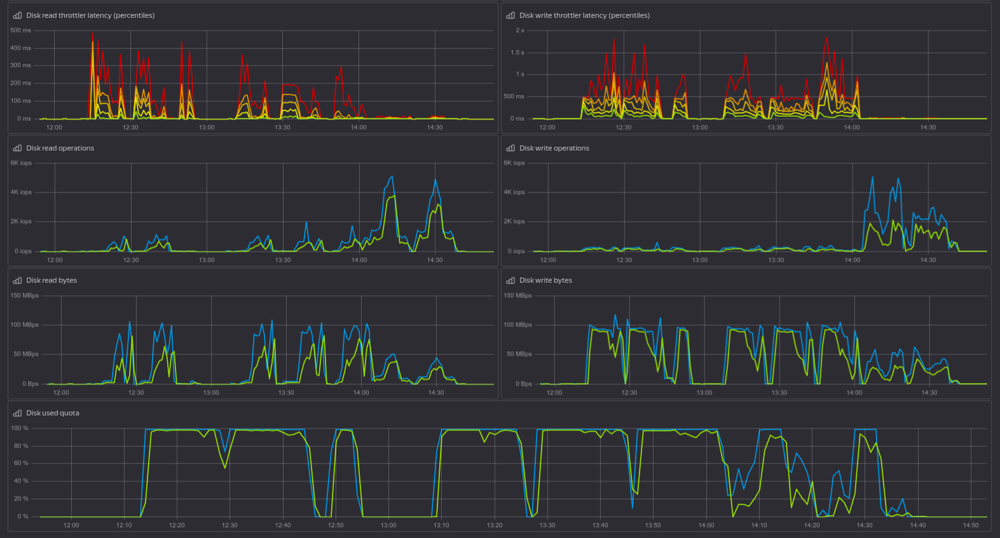

# Оптимизация настроек Postgresql

## Подготовка

- создается ВМ с параметрами
  - vCPU 4
  - RAM 16GB
  - / - SSD 20GB, Ubuntu 24.04
    - Макс. IOPS (чтение / запись) 1000 / 1000
    - Макс. bandwidth (чтение / запись) 15 МБ/с / 15 МБ/с
  - /data - SSD 180GB
    - Макс. IOPS (чтение / запись) 6000 / 6000
    - Макс. bandwidth (чтение / запись) 90 МБ/с / 90 МБ/с

- устанавливается PostgreSQL `apt install postgresql`
- переносим каталог `/var/lib/postgresql` на выделенный диск (`/data`)
  
```bash
systemctl stop postgresql@16-main
mv /var/lib/postgresql /data/
ln -s /data/postgresql /var/lib/postgresql
systemctl start postgresql@16-main
```

## Режимы тестирования

Используемые режимы тестирования:

- `default` (смешаные запросы)
- `--select-only` (SELECT ONLY)
- `--skip-some-updates` (UPDATE)

## Тестирование

- создаем БД test

```sql
create database test;
```

- наполняем тестовыми данными

`pgbench -h 127.0.0.1 test -i -s 1000 -I dtGvpf`

- прогоняем 3 теста (скрипт)

```bash
#!/bin/bash
CLIENTS=16
THREADS=4
TIME=300

for MODE in '' '--select-only' '--skip-some-updates'
do
pgbench -h 127.0.0.1 test ${MODE} -c $CLIENTS -j $THREADS \
  -T ${TIME} 2>&1 | \
  tee ${CLIENTS}_${THREADS}_${TIME}${MODE}.log
done
```

## Тюнинг

- ОС

создаем `/etc/sysctl.d/11-postgresql.conf`

```conf
vm.swappiness=5
vm.nr_hugepages=3000
```

```bash
#apply
sysctl -p --system

#check
cat /proc/meminfo|grep -i huge
```

```text
AnonHugePages:         0 kB
ShmemHugePages:        0 kB
FileHugePages:         0 kB
HugePages_Total:    3000
HugePages_Free:     2944
HugePages_Rsvd:     2051
HugePages_Surp:        0
Hugepagesize:       2048 kB
Hugetlb:         6144000 kB
```

- postgresql (/etc/postgresql/16/main/conf.d/tune.conf)

```conf
# Memory Configuration
huge_pages = on
shared_buffers = 4GB
effective_cache_size = 11GB
work_mem = 77MB
maintenance_work_mem = 768MB

# Checkpoint Related Configuration
min_wal_size = 2GB
max_wal_size = 3GB
checkpoint_completion_target = 0.9
wal_buffers = -1

# Storage Configuration
random_page_cost = 1.1
effective_io_concurrency = 200

# Worker Processes Configuration
max_worker_processes = 8
max_parallel_workers_per_gather = 2
max_parallel_workers = 2

# Logging configuration for pgbadger
logging_collector = on
log_checkpoints = on
log_connections = on
log_disconnections = on
log_lock_waits = on
log_temp_files = 0
lc_messages = 'C'

# Adjust the minimum time to collect the data
log_min_duration_statement = '10s'
log_autovacuum_min_duration = 0
```

## Результаты

<table>
  <tr>
    <th>Шаг</td>
    <th>default, sec</td>
    <th>tune (huge pages off), sec.</td>
    <th>tune (huge pages on), sec.</td>
  </tr>

  <tr>
    <td colspan="4">Наполнение тестовой БД (init)</td>
  </tr>

  <tr>
    <td>server-side generate</td>
    <td>381.29</td>
    <td>480.64</td>
    <td>477.70</td>
  </tr>

  <tr>
    <td>vacuum</td>
    <td>273.85</td>
    <td>208.34</td>
    <td>180.31</td>
  </tr>

  <tr>
    <td>primary keys</td>
    <td>251.03</td>
    <td>265.96</td>
    <td>246.86</td>
  </tr>

  <tr>
    <td>foreign keys</td>
    <td>130.62</td>
    <td>99.61</td>
    <td>82.22</td>
  </tr>
</table>


<table>
<tr>
<th>profile</th>
<th colspan="3">default</th>
<th colspan="3">tune, huge pages <b style="color:red">OFF</b></th>
<th colspan="3">tune, huge pages <b style="color:green">ON</b></th>
</tr>

<tr>
<th>transaction type</th>
<th>builtin: TPC-B (sort of)</th>
<th>builtin: select only</dh>
<th>builtin: simple update</th>
<th>builtin: TPC-B (sort of)</th>
<th>builtin: select only</dh>
<th>builtin: simple update</th>
<th>builtin: TPC-B (sort of)</th>
<th>builtin: select only</dh>
<th>builtin: simple update</th>
</tr>

<tr>
<th align="left">number of transactions actually processed</th>
<td align="right">229345</td>
<td align="right">1572371</td>
<td align="right">280367</td>
<!--  -->
<td align="right">346154</td>
<td align="right">1156188</td>
<td align="right">346749</td>
<!--  -->
<td align="right">359719</td>
<td align="right">1096039</td>
<td align="right">385892</td>
</tr>

<tr>
<th align="left">number of failed transactions</th>
<td align="right">0</td>
<td align="right">0</td>
<td align="right">0</td>
<!--  -->
<td align="right">0</td>
<td align="right">0</td>
<td align="right">0</td>
<!--  -->
<td align="right">0</td>
<td align="right">0</td>
<td align="right">0</td>
</tr>

<tr>
<th align="left">latency average,  ms</th>
<td align="right">20.924</td>
<td align="right">3.052</td>
<td align="right">17.117</td>
<!--  -->
<td align="right">13.863</td>
<td align="right">4.150</td>
<td align="right">13.838</td>
<!--  -->
<td align="right">13.340</td>
<td align="right">4.378</td>
<td align="right">12.435</td>
</tr>

<tr>
<th align="left">initial connection time, ms</th>
<td align="right">106.297</td>
<td align="right">118.938</td>
<td align="right">118.961</td>
<!--  -->
<td align="right">114.384</td>
<td align="right">104.099</td>
<td align="right">109.060</td>
<!--  -->
<td align="right">107.717</td>
<td align="right">101.706</td>
<td align="right">109.596</td>
</tr>

<tr>
<th align="left">tps</th>
<td align="right">764.679772</td>
<td align="right">5243.057598</td>
<td align="right">934.763218</td>
<!--  -->
<td align="right">1154.133527</td>
<td align="right">3855.192994</td>
<td align="right">1156.200316</td>
<!--  -->
<td align="right">1199.442373</td>
<td align="right">3654.460843</td>
<td align="right">1286.666376</td>
</tr>

</table>

## "Экстремальная" настройка - уменьшение надежности

```conf
fsync = off
synchronous_commit = off
checkpoint_completion_target = 1.0
effective_io_concurrency = 100
random_page_cost = 1.1
```


<table>
<tr>
<th>profile</th>
<th colspan="3">tune + <b style="color:blue">extreme</b>, huge pages <b style="color:green">ON</b></th>
</tr>

<tr>
<th>transaction type</th>
<th>builtin: TPC-B (sort of)</th>
<th>builtin: select only</dh>
<th>builtin: simple update</th>
</tr>

<tr>
<th align="left">number of transactions actually processed</th>
<td align="right">626350</td>
<td align="right">998831</td>
<td align="right">659015</td>
</tr>

<tr>
<th align="left">number of failed transactions</th>
<td align="right">0</td>
<td align="right">0</td>
<td align="right">0</td>
</tr>

<tr>
<th align="left">latency average,  ms</th>
<td align="right">7.664</td>
<td align="right">4.805</td>
<td align="right">7.281</td>
</tr>

<tr>
<th align="left">initial connection time, ms</th>
<td align="right">105.764</td>
<td align="right">118.938</td>
<td align="right">110.938</td>
</tr>

<tr>
<th align="left">tps</th>
<td align="right">2087.650782</td>
<td align="right">3330.137294</td>
<td align="right">2197.435367</td>
</tr>

</table>

## Выводы

На общую производительность текущей системы сильно влияет низкая производительность дисковой подсистемы - не смотря на выделенный SSD (но с органиченным объемом) не получится добиться существенного изменения за счет "игр" с параметрами памяти. Диск перегружен на уровне виртуализации. Возможно влияние на уровне хост-системы.

